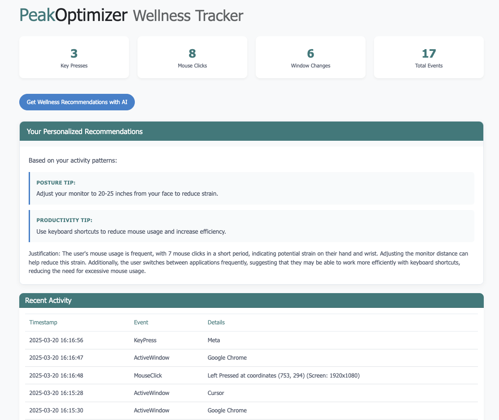

# PeakOptimizer

🚀 **PeakOptimizer** is an AI-powered tool that helps you stay focused, avoid burnout, and maintain good posture while working. It combines productivity and health tech to keep you at your best.

## 🔹 What It Does
- **Tracks work habits**: Monitors posture, typing patterns, screen usage, and stress levels.
- **Provides smart reminders**: Suggests breaks, movement, and ergonomic fixes based on your needs.
- **Adapts to you**: Learns your work patterns and gives personalized recommendations.
- **Protects your health**: Helps prevent eye strain, back pain, and repetitive strain injuries.

## 🚀 Getting Started
1. Clone the repository:
   ```bash
   git clone https://github.com/issamlaradji/productivity_advisor.git
   ```
2. Navigate to the folder:
   ```bash
   cd productivity_advisor
   ```
3. Install dependencies:
   ```bash
   pip install -r requirements.txt
   ```

4. Set up your Together AI API key:
   - Create a file named `api_keys.json` in the root directory
   - Add your API key in the following format:
     ```
     {"together":"your_api_key_here"}
     ```
   - You can obtain an API key by:
     - Asking Issam for access, or
     - Creating an account at [together.ai](https://together.ai) and generating a key

5. Run the Flask app:
   ```bash
   python main.py
   ```

## 📊 Dashboard Preview

Here's a preview of the PeakOptimizer dashboard:




## 📜 License
Licensed under the MIT License - see the [LICENSE](LICENSE) file.

## 📫 Contact
Questions or ideas? Reach out anytime!

---

🌟 **PeakOptimizer** helps you work smarter and stay healthy!
